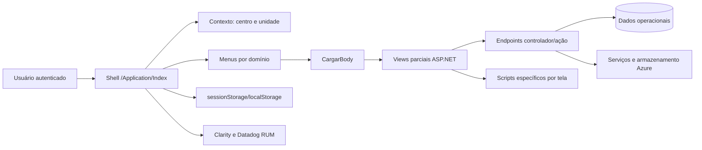

# Engenharia reversa observável do TryController

**Autor:** Manus AI  
**Data:** 13 de julho de 2026  
**Escopo:** análise funcional, de experiência e de arquitetura observável em conta autorizada

## Resumo executivo

O TryController é uma plataforma operacional e administrativa organizada em quatro domínios principais: **vendas**, **centros de negócios**, **administração** e **relatórios**. A aplicação combina controle de caixas, registro de movimentações, transferências, gestão de unidades e trabalhadores, administração de usuários e perfis, além de um catálogo amplo de relatórios. A navegação é centralizada em uma página contêiner autenticada, que carrega telas parciais por AJAX sem alterar a rota principal exibida no navegador.[1]

A inspeção não destrutiva indica uma arquitetura web **ASP.NET sobre Microsoft IIS**, com interface server-rendered baseada em **jQuery**, **Bootstrap**, **Select2**, **DataTables** e componentes do tema Metronic. O conteúdo funcional é distribuído por rotas no padrão controlador/ação e inserido dinamicamente na área central da página. Foram identificadas passivamente **51 rotas de menu**, inventariadas em arquivos separados, sem enumeração externa ou chamadas invasivas.[1]

> **Conclusão principal:** para reconstruir uma solução funcionalmente equivalente, o elemento central não é uma tela isolada, mas o modelo hierárquico **sociedade → centro de negócios → unidade → caixa**, associado a usuários, perfis, trabalhadores, clientes, movimentações e relatórios.

## 1. Metodologia e limites

A análise foi realizada por meio de autenticação autorizada, navegação manual em modo somente leitura, inspeção dos elementos normalmente entregues ao navegador, observação dos recursos carregados e extração passiva das rotas presentes no HTML autenticado. Nenhuma credencial foi armazenada nos artefatos produzidos.[1]

Não foram realizados fuzzing, força bruta, enumeração de diretórios, manipulação de parâmetros, testes de autorização, exploração de vulnerabilidades, criação ou edição de registros, abertura ou fechamento de caixas, transferências, exportações, respostas a pesquisas ou qualquer tentativa de contornar controles. Os resultados descrevem apenas o que foi legitimamente exposto à sessão autorizada.

## 2. Modelo funcional da plataforma

A organização da interface sugere um sistema multiunidade no qual cada operação depende de um **contexto organizacional selecionado**. O usuário escolhe um centro de negócios e uma unidade por meio de uma árvore territorial; telas operacionais podem exigir ainda a seleção de uma caixa. Esse contexto é reutilizado entre módulos e parcialmente preservado no armazenamento de sessão do navegador.[1]

| Domínio | Responsabilidade observada | Entidades e processos centrais |
|---|---|---|
| Vendas | Operação financeira na unidade | vendas, receitas complementares, gastos, caixa, chaves, limpeza de cobrança e transferências de vendas |
| Centros de negócios | Consolidação e governança regional | receitas, despesas, transferências, aprovações, caixas, mapas, faturamento, seguros e movimentação de unidades |
| Administração | Configuração estrutural e acesso | sociedades, centros, unidades, trabalhadores, dispositivos, tipos de movimento, usuários, perfis e clientes |
| Relatórios | Supervisão, auditoria e análise | vendas, plataforma, filas, logs, localização, dispositivos, alertas e relatórios personalizados |

## 3. Inventário funcional observado

### 3.1 Vendas

O módulo de vendas expõe **Ingresos / Complementarios**, **Gastos**, **Ventas**, gestão de caixa, **Resumen**, criação de chave, limpeza de cobrança, resumo por período, abertura massiva de caixas e transferência massiva de vendas. O resumo operacional possui abas de visão consolidada e detalhes, mas permanece em estado vazio até que uma unidade e uma caixa sejam selecionadas.[1]

O fluxo de caixa é explicitamente segmentado em **abrir**, **fechar** e **confirmar**. Essa separação sugere estados operacionais com responsabilidades distintas e potencial aprovação por outro perfil. A tela de acompanhamento apresenta estados como sem caixa, aberta, fechada e confirmada, além de indicadores de progresso e sincronização.

### 3.2 Centros de negócios

O domínio de centros de negócios oferece receitas, despesas, transferência de dinheiro, aprovação de transferências, gestão de caixa, resumo, mapa, faturamento, aprovações, resumo por período, fechamento massivo, transferência de unidades, seguros e uma área de financiamento. O módulo funciona como uma camada de consolidação sobre as unidades vinculadas.[1]

### 3.3 Administração

A administração é dividida em **Gestão de Plataforma**, **Gestão de Usuários** e **Gestão de Clientes**. A primeira contém sociedades, centros de negócios, unidades, trabalhadores, tipos de movimento, dispositivos e liquidação de trabalhadores. A segunda contém perfis, usuários e atribuição de unidades. A terceira inclui clientes, lista negra e atividade econômica.[1]

A tela de sociedades representa o padrão de cadastro observado: título, ação de criação, busca, tabela paginada e consulta ou edição por registro. Isso fornece um modelo reutilizável para os demais cadastros administrativos.

### 3.4 Relatórios

O catálogo inclui relatórios de vendas e plataforma, processos enfileirados, logs de ações e do aplicativo móvel, relatórios personalizados e rápidos, localização de trabalhadores, dispositivos vinculados e histórico de alertas de pânico. A tela de relatórios de vendas usa seleção de relatório, geração sob demanda e exportação para Excel.[1]

Foram observadas categorias relacionadas a caixas sem movimento, créditos, carteira, clientes, desempenho, gastos, retiradas, receitas por unidade, margens, movimentos, notas, novas vendas, renovações, trabalhadores, pagamentos e unidades de serviço. Esse catálogo deve ser tratado como um subsistema próprio, não como simples extensão das telas transacionais.

## 4. Padrões de interface e experiência

A interface mantém um cabeçalho global com menus por domínio, seletores de centro e unidade, perfil, novidades e suporte. O conteúdo central troca dinamicamente, enquanto a URL principal permanece em `/Application/Index`. Estados de carregamento, mensagens orientativas e filtros dependentes ajudam a conduzir o usuário pelas pré-condições de cada operação.[1]

| Padrão | Implementação observada | Implicação para reconstrução |
|---|---|---|
| Contexto global | Centro e unidade selecionados no cabeçalho | O contexto deve ser compartilhado entre rotas e validado no servidor |
| Navegação dinâmica | Views parciais carregadas na área central | Uma nova versão pode usar SPA, mas deve preservar transições e contexto |
| Listagens | Busca, paginação e ação por linha | Criar um componente de tabela administrativo reutilizável |
| Relatórios | Catálogo, filtros, geração e Excel | Separar geração assíncrona, histórico e download |
| Operações de caixa | Pré-condições e estados sequenciais | Implementar máquina de estados e trilha de auditoria |
| Estados vazios | Mensagens como “selecione uma unidade” | Tornar dependências visíveis antes de habilitar ações |
| Responsividade | Menus e atalhos ajustados por largura | Projetar primeiro para desktop operacional, com adaptação móvel controlada |

Também foram observados um modal de novidades, uma pesquisa NPS, suporte via WhatsApp e uma barra lateral de contatos e grupos. Esses elementos são periféricos ao núcleo transacional e podem ser deixados para fases posteriores de um produto reimplementado.

## 5. Arquitetura técnica observável

O servidor expôs `Microsoft-IIS/10.0` e `ASP.NET` em cabeçalhos de uma solicitação de inspeção. A página carrega jQuery, Bootstrap, Select2, DataTables, FullCalendar, SweetAlert2, Google Charts, SheetJS/XLSX e Lottie. Não foram observados sinais globais de React, Vue ou Angular na sessão analisada.[1]

A função cliente responsável pela navegação, `CargarBody`, prepara a interface, exibe um carregador, executa verificações de redirecionamento e usa `$("#bodyForms").load(ControllerAction)` para inserir a resposta HTML. Isso caracteriza uma **aplicação server-rendered com shell persistente e views parciais via AJAX**.[1]

A aplicação usa armazenamento do navegador para sinais de unidade, centro de negócios, última seleção, relatório e notificações. Imagens promocionais são servidas por Azure Blob Storage, e ao menos um backend complementar foi observado em `azurewebsites.net`. Microsoft Clarity e Datadog RUM aparecem como ferramentas de telemetria.[1]

## 6. Modelo de dados inferido

O modelo abaixo é uma hipótese funcional a ser validada em futuras observações. Ele não representa acesso ao banco de dados nem descoberta de esquema interno.

| Entidade | Relações prováveis | Atributos mínimos para uma reimplementação |
|---|---|---|
| Sociedade | possui centros de negócios | código, nome, descrição e status |
| Centro de negócios | pertence à sociedade e possui unidades | código, nome, localização e configuração financeira |
| Unidade | pertence ao centro e opera caixas | código, tipo, localização, status e sincronização |
| Caixa | pertence à unidade e possui movimentos | data, estado, saldo inicial, saldo final e responsável |
| Movimento | pertence à caixa ou centro | tipo, valor, data, origem, destino e comprovante |
| Venda/Crédito | pertence à unidade, caixa e cliente | valor, parcelas, situação, vendedor e datas |
| Cliente | associado a vendas e crédito | identificação, contatos, atividade econômica e risco |
| Trabalhador | associado a unidades e operações | identificação, função, status, localização e liquidação |
| Usuário | possui perfil e escopo organizacional | credencial, perfil, unidades atribuídas e status |
| Perfil | agrupa permissões | ações, módulos, limites e regras de aprovação |
| Dispositivo | vinculado a unidade ou trabalhador | identificador, versão, vínculo e última sincronização |
| Relatório | consulta dados por filtros | tipo, parâmetros, solicitante, status e arquivo gerado |
| Log de auditoria | registra ações sensíveis | usuário, ação, entidade, antes/depois, data e origem |

## 7. Regras de negócio prioritárias para validação

A reconstrução deve validar primeiro a hierarquia organizacional e o escopo de acesso, pois quase todos os módulos dependem dela. Em seguida, deve confirmar a máquina de estados da caixa, os tipos de movimento permitidos, as regras de aprovação e transferência e a forma como vendas, créditos e pagamentos afetam saldos.

| Prioridade | Regra ainda não confirmada | Método seguro de validação |
|---|---|---|
| Alta | Quem pode abrir, fechar e confirmar uma caixa | Observar permissões em contas de teste e documentação fornecida pelo proprietário |
| Alta | Como saldos são calculados | Usar dados fictícios em ambiente de homologação |
| Alta | Como unidades são atribuídas a usuários | Mapear perfis e escopos sem alterar produção |
| Alta | Regras de aprovação de transferências | Documentar estados, responsáveis e recusas em homologação |
| Média | Ciclo de vida de venda, crédito e pagamento | Executar cenário completo com cliente fictício |
| Média | Sincronização com aplicativo e dispositivos | Capturar contrato de integração disponibilizado pelo proprietário |
| Média | Geração síncrona ou enfileirada de relatórios | Observar relatório pequeno e relatório de grande volume em ambiente controlado |
| Baixa | Pesquisa, novidades, contatos e suporte | Reproduzir somente após estabilização do núcleo operacional |

## 8. Estratégia recomendada de reconstrução independente

A implementação deve seguir uma abordagem **clean-room**: reproduzir requisitos e comportamentos legítimos sem copiar código-fonte, textos proprietários extensos, imagens, marcas, dados de clientes ou segredos da aplicação original. O inventário atual deve ser usado como especificação de domínio e não como autorização para exploração técnica.

### Fase A — fundação

Construir autenticação, perfis e permissões, sociedades, centros, unidades, trabalhadores e o seletor global de contexto. Definir desde o início auditoria, segregação por organização e proteção de operações financeiras.

### Fase B — operação mínima

Implementar abertura, fechamento e confirmação de caixa; receitas, despesas e vendas; resumo operacional; clientes; tipos de movimento; anexos e trilha de auditoria. Essa fase constitui o primeiro MVP realmente utilizável.

### Fase C — consolidação

Adicionar transferências entre centros, aprovações, resumos por período, faturamento, dispositivos e sincronização. Operações massivas devem entrar somente depois que regras unitárias estiverem testadas.

### Fase D — inteligência e escala

Criar geração assíncrona de relatórios, exportação Excel, filas, logs administrativos, dashboards, alertas e telemetria. Relatórios devem consultar uma camada preparada para leitura para não degradar o processamento transacional.

## 9. Arquitetura recomendada para uma nova versão

Uma reimplementação moderna não precisa replicar a arquitetura legada. Recomenda-se frontend tipado, API versionada, banco relacional, armazenamento de arquivos, fila de tarefas e autorização centralizada. A seleção de tecnologia pode variar, mas os limites de domínio devem permanecer explícitos.

| Camada | Responsabilidade recomendada |
|---|---|
| Interface web | Navegação, contexto global, formulários, tabelas e dashboards |
| API de aplicação | Regras de caixa, vendas, transferências, aprovações e cadastros |
| Identidade e autorização | Login, sessão, MFA opcional, perfis e escopo por unidade |
| Banco transacional | Entidades operacionais, integridade e histórico financeiro |
| Auditoria imutável | Registro de ações administrativas e financeiras |
| Fila de tarefas | Relatórios, exportações, notificações e integrações |
| Armazenamento de objetos | Comprovantes, relatórios e arquivos de sincronização |
| Observabilidade | métricas, logs, rastreamento e alertas sem expor dados sensíveis |

## 10. Próximo ciclo recomendado

O próximo passo de maior valor é escolher **um fluxo vertical** e documentá-lo ponta a ponta em ambiente de teste: pré-condições, campos, validações, estados, permissões, efeitos financeiros, erros e relatórios resultantes. O melhor candidato é **abrir caixa → registrar uma operação fictícia → fechar → confirmar → consultar resumo**, desde que exista autorização para usar dados de teste e realizar alterações controladas.

Como alternativa sem qualquer escrita em produção, podemos aprofundar um módulo em modo leitura — por exemplo, usuários e perfis, relatórios, clientes ou dispositivos — e produzir wireframes, contrato de API proposto e esquema de banco para a futura implementação.

## Referências

[1]: https://trycontroller.co/ "TryController — aplicação analisada em sessão autorizada"
