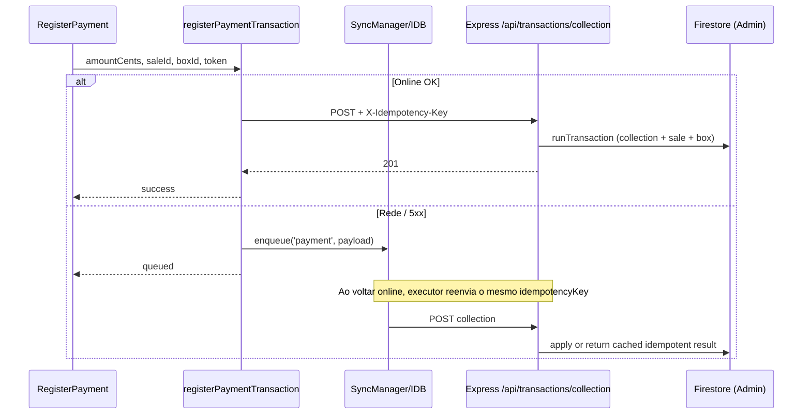

# ControlMax — Arquitetura SSOT (Single Source of Truth)

**Status:** canônico pós-refatoração piloto (Fases 0–5 + P1/P2 código)  
**Branch de referência:** `merged-dev-fabio`  
**Data:** 27/08/2026  

> Este arquivo é a **fonte única de verdade** da arquitetura em execução.  
> Documentos satélite: [`ARQUITETURA.md`](./ARQUITETURA.md) (legado/ponte), [`PENDENCIAS-DESENVOLVIMENTO.md`](../planejamento/PENDENCIAS-DESENVOLVIMENTO.md), [`PLANO-DESENVOLVIMENTO.md`](../planejamento/PLANO-DESENVOLVIMENTO.md), [`AGENTS.md`](../../AGENTS.md), [`docs/controlmax/`](../controlmax/00-indice.md).

---

## 1. VISÃO GERAL E PILARES ARQUITETURAIS

### 1.1 Monorepo

```
ControlMax/
├── frontend/          # React 19 + Vite 6 + Tailwind CSS v4 + React Router 7
├── backend/           # Express (BFF) + Firebase Admin SDK + Gemini
├── docs/              # Documentação oficial (SSOT, planos, ops, specs)
├── scripts/           # Utilitários (ex.: maintenance/)
├── firestore.rules
├── firestore.indexes.json
├── firebase.json
├── vercel.json
└── package.json       # workspaces: frontend, backend
```

| Pacote | Stack (package.json) | Papel |
|--------|----------------------|-------|
| `frontend` | React 19, Vite 6, Firebase client 12.x | SPA, leituras autorizadas, fila offline |
| `backend` | Express 4, Node 20, firebase-admin 14, firebase-functions v2 | BFF financeiro + admin + assistente |

### 1.2 Pilares

| Pilar | Regra |
|-------|--------|
| **Multi-tenant** | Todo documento operacional carrega `tenantId`. Queries client: `where('tenantId','==',tenantId)`. Rules validam `userTenantId()` / claims. |
| **Centavos** | Valores monetários = **inteiros** no Firestore e BFF. Exibição: `fmtCents` / `currency.ts` (wrappers legados reexportam). Nunca persistir float de dinheiro. |
| **Comunicação híbrida** | **Leitura:** Client SDK (`onSnapshot` / `getDocs`) quando rules permitem. **Mutações financeiras e sensíveis:** exclusivamente BFF `POST/PUT /api/*` via Admin SDK. |
| **Idempotência** | Mutações financeiras enviam `X-Idempotency-Key` (+ corpo `idempotencyKey`). Ver `financialFetchHeaders.ts` e `backend/idempotency.ts`. |
| **Offline** | `SyncManager` (IndexedDB) enfileira `openBox` / `closeBox` / `sale` / `payment` / … e reprocessa via executors HTTP → BFF. |

### 1.3 Hierarquia operacional (piloto)

```
tenantId (Sociedade) → business_centers (CN) → routes/units → boxes / sales / collections
users.usuario_unidades[] = unitIds permitidos (canônico; aliases de leitura: usuarioUnidades / assignedUnits)
```

CTX-03: Sociedade ≡ `tenantId`. CRUD multi-sociedade fora do piloto.

---

## 2. FLUXO DE DADOS & PADRÃO DE DESIGN (SCREEN / HOOK / BFF)

### 2.1 Padrão em camadas

```
Screen (JSX shell)
  → Custom Hook(s) / utils de domínio
    → online: fetch `/api/...` + Bearer JWT + X-Idempotency-Key
    → offline/rede: SyncManager.enqueue → IndexedDB
      → SyncStatusBadge / processadores → Executor HTTP
        → Express authMiddleware
          → Route handler
            → Admin SDK (transação Firestore)
              → writeAuditLog / logAuditEvent (quando aplicável)
```

**Regra:** telas não embutem lógica financeira de escrita. Hooks/utils chamam BFF; screens orquestram UI.

### 2.2 SyncManager (offline)

| Artefato | Path |
|----------|------|
| Fila | `frontend/src/utils/syncManager.ts` |
| IndexedDB | `frontend/src/utils/indexedDB.ts` |
| Executors | `frontend/src/utils/sync/executors/*` (`paymentExecutor`, `saleExecutor`, `openBoxExecutor`, `closeBoxExecutor`, …) |
| Badge UI | `frontend/src/components/sync/SyncStatusBadge.tsx` |

`OperationType`: `openBox` | `closeBox` | `sale` | `payment` | `adjustment` | `reversal`.  
`id` da transação = `idempotencyKey`.

### 2.3 Sequência — pagamento / visita (collection)



Fluxo análogo para venda: `VendedorMobile` / `SaleExecutor` → `POST /api/transactions/sale`.

### 2.4 Montagem BFF (`backend/server.ts`)

| Prefixo | Router |
|---------|--------|
| `POST /api/gemini/assistant` | `assistantRoute` |
| `/api/boxes` | `boxRoutes` |
| `/api/transactions` | `transactionRoutes` |
| `/api/customers` | `customerRoutes` |
| `/api/platform` | `platformRoutes` |
| `/api/reports` | `reportRoutes` |
| `/api/admin` | `saasBillingRoutes` + `adminRoutes` |
| `/api/admin/roles` | `roleRoutes` |

Produção: export `api` como Cloud Function Gen2 (`firebase-functions/v2/https`). Local: `LOCAL_DEV=true` → `listen(3000)`.

---

## 3. RBAC DINÂMICO & AUDITORIA UNIFICADA

### 3.1 PermissionMatrix

Tipagem espelhada: `frontend/src/types/rbac.ts` ↔ `backend/permissionMatrix.ts`.

```
users.roleId ──▶ tenant_roles/{id}.permissions (PermissionMatrix)
       └─▶ role legado (admin|supervisor|collector) para compatibilidade
```

Módulos / ações:

| Módulo | Ações |
|--------|--------|
| `sales` | `read`, `create`, `update`, `cancel` |
| `collections` | `read`, `create`, `confirm` |
| `boxes` | `read`, `open`, `close`, `viewSummary` |
| `customers` | `read`, `create`, `edit`, `delete` |
| `reports` | `viewDashboard`, `exportExcel` |
| `platform` | `manageSettings`, `manageUsers`, `manageRoles` |

- Coleção `tenant_roles`: escrita **só Admin SDK** (`firestore.rules` deny create/update/delete).
- BFF: `GET/POST/PUT/DELETE /api/admin/roles`; `assertPermission` / `requirePermission`.
- UI: `RoleManagement.tsx`, `useHasPermission()`, `useTenantRoles()`.
- `isSystemRole: true` → não excluir (apenas editar/clonar).
- Auth: Custom Claims `{ role, tenantId, isSuperAdmin }` (ADR-001); middleware prioriza claims, Firestore fallback legado. Script: `backend/scripts/backfillCustomClaims.ts`.

### 3.2 Auditoria (`audit_logs`)

Modelo: `frontend/src/types/audit.ts` / `backend/auditLog.ts`.

| Campo | Conteúdo |
|-------|----------|
| `action` | `UPDATE` \| `DELETE` \| `REVERSAL` \| `OVERRIDE` |
| `entity` | `sales` \| `customers` \| `boxes` \| `collections` \| `platform_settings` \| `users` \| `roles` |
| `changes[]` | `{ field, oldValue, newValue }` (diff imutável) |
| `reason` | Obrigatório em estorno / override / mutações sensíveis |

Serviço: `backend/services/auditService.ts` → `logAuditEvent` (diff + `writeAuditLog` / `setAuditLogInTransaction`).

Rotas que gravam auditoria (não exaustivo de todos os logs, mas canônicas):

- `PUT /api/customers/:id`
- `POST /api/transactions/reversal` (+ adjustment)
- `PUT /api/admin/roles/:id`, `PUT /api/admin/users/:id`
- `PUT /api/platform/settings`

UI: `AuditLogs.tsx`. Client write em `audit_logs` / `security_logs` = **deny**.

### 3.3 Ledger sombra (`ledger_shadow`) — ENT-02

Append-only paralelo; **não** é fonte de saldo até `ENT-09`.

| Campo | Conteúdo |
|-------|----------|
| `debitAccount` / `creditAccount` | Contas canônicas (`caixa:{id}`, `recebiveis:{id}`, `cn:{id}`, …) |
| `amountCents` | Inteiro > 0 |
| `transactionId` | Idempotency key / correlação |
| `source` | `sale` \| `collection` \| `reversal` \| `box_open` \| … |
| `mode` | sempre `"shadow"` |

Serviço: `backend/services/ledgerService.ts`. Reconcile: `GET /api/transactions/ledger/reconcile/:boxId`. Client write = **deny**.

---

## 4. PERÍMETRO DE SEGURANÇA E REGRAS DE FIRESTORE

### 4.1 Escritas bloqueadas no client (Admin SDK / BFF only)

| Coleção | Rules |
|---------|--------|
| `sales` | `create/update/delete: if false` |
| `boxes` (+ `transactions` sub) | `create/update/delete` / write false |
| `collections` | `create/update/delete: if false` |
| `payments`, `expenses`, `incomes`, `transfers`, `bc_*`, `unit_transfers` | write false |
| `security_logs`, `audit_logs`, `ledger_shadow` | create/update/delete false |
| `tenant_roles`, `customer_blacklist`, `report_jobs`, `saas_invoices` | mutações false no client |

Leituras permanecem filtradas por `tenantId` / papel (ver `firestore.rules`).

### 4.2 Auth BFF (`backend/authMiddleware.ts`)

1. Header `Authorization: Bearer <Firebase ID Token>`.
2. Verifica token com Admin Auth.
3. Resolve perfil: **Custom Claims** primeiro; documento `users/{uid}` como fallback legado (`resolveAuthProfile` em `customClaims.ts`).
4. Anexa `req.user`: `uid`, `email`, `tenantId`, `role`, `roleId`, `permissions`, `isSuperAdmin`.

Credenciais Admin: `GOOGLE_APPLICATION_CREDENTIALS` (path JSON) **ou** `FIREBASE_SERVICE_ACCOUNT_KEY` (JSON string).

### 4.3 Anti-bypass / identidade

- Login **sem** auto-provision (SEC-01).
- Remoção de hardcodes de privilégio / emails de impersonação (SEC-02).
- Impersonação SuperAdmin: flag de sessão explícita (`controlmax_impersonated_tenant`), não lista de e-mails.
- `getDemoUser()` → `null` (modo demo off).
- Escopo de unidade: `usuario_unidades` validado no BFF de caixa (`userUnitAccess.ts`).

---

## 5. DEPLOYS & INFRAESTRUTURA (VERCEL + BACKEND)

### 5.1 Frontend (Vercel)

| Opção | Config |
|-------|--------|
| **A** Root Directory = `frontend` | Build `npm run build`, Output `dist`, `frontend/vercel.json` rewrites SPA |
| **B** Monorepo root | `/vercel.json`: build `cd frontend && npm ci && npm run build`, output `frontend/dist` |

Rewrites: `{ "source": "/(.*)", "destination": "/index.html" }` — sem isso, deep links (`/sales`) → 404.

Proxy `/api` do Vite **só** em `npm run dev`. Produção usa `VITE_API_URL`.

### 5.2 Backend

- Local: `cd backend && npm run dev` (`LOCAL_DEV=true`, porta **3000**).
- Produção típica: Firebase Cloud Function `api` (Gen2, `us-central1`) **ou** host Node com `npm run build && npm start`.
- CORS: `FRONTEND_ORIGIN` (default `http://localhost:5173`).

### 5.3 Variáveis de ambiente

#### Frontend (local / Vercel)

| Variável | Obrigatória | Uso |
|----------|-------------|-----|
| `VITE_FIREBASE_API_KEY` | Sim* | Firebase client |
| `VITE_FIREBASE_AUTH_DOMAIN` | Sim* | Auth |
| `VITE_FIREBASE_PROJECT_ID` | Sim* | Projeto |
| `VITE_FIREBASE_STORAGE_BUCKET` | Sim* | Storage |
| `VITE_FIREBASE_MESSAGING_SENDER_ID` | Sim* | FCM |
| `VITE_FIREBASE_APP_ID` | Sim* | App ID |
| `VITE_FIRESTORE_DATABASE_ID` | Condicional | DB não-default |
| `VITE_API_URL` | Sim em prod | Base do BFF (sem path `/api` duplicado no client helper) |

\* Sem env, fallback `firebase-applet-config.json` (gitignored) / `.example.json` (stub CI).

Declaração tipada: `frontend/src/vite-env.d.ts`.

#### Backend (local / Cloud)

| Variável | Obrigatória | Uso |
|----------|-------------|-----|
| `GEMINI_API_KEY` | Para assistente | Gemini |
| `FRONTEND_ORIGIN` | Recomendado | CORS |
| `LOCAL_DEV` | Local | `true` → HTTP listen |
| `GOOGLE_APPLICATION_CREDENTIALS` | Sim** | Path service account |
| `FIREBASE_SERVICE_ACCOUNT_KEY` | Alternativa** | JSON inline |

\** Uma das duas formas de credencial Admin.

Scripts auxiliares: `DRY_RUN`, `TENANT_ID` (backfill claims); seeds usam `QA_*` / `CLIENT_PASSWORD` opcionais.

### 5.4 Firestore ops (outro time)

Deploy Gate: [`DEPLOY-FIRESTORE-GATE.md`](../ops/DEPLOY-FIRESTORE-GATE.md) — `firebase deploy --only firestore:rules,firestore:indexes`.  
Projeto default `.firebaserc`: `ai-studio-33f8fa6b-5557-48dc-aeb6-271cd5c38c6d`.

### 5.5 Checklist build

```bash
cd frontend && npm run lint && npm run test && npm run build
cd ../backend && npm run build && npm test
```

---

## 6. CATÁLOGO DE COMPONENTES E HOOKS CRÍTICOS

### 6.1 Mapa módulo → UI → hook/util → BFF

| Módulo | UI | Hooks / utils | Endpoints BFF |
|--------|-----|---------------|---------------|
| Caixa | `OpenBox`, `CloseBox`, `BoxSummary`, `MassBoxOpening`, `MassBoxClosing` | `useBox`, `massBoxBatchApi`, sync executors | `POST /api/boxes/open\|close\|confirm\|open-batch\|close-batch` |
| Venda | `VendedorMobile`, listas de vendas | sync `SaleExecutor`, mappers | `POST /api/transactions/sale` |
| Cobrança / visita | `RegisterPayment` | `registerPaymentTransaction`, `PaymentExecutor` | `POST /api/transactions/collection` |
| Estorno / ajuste | Sale detail / finance | transaction helpers | `POST /api/transactions/reversal`, `/adjustment` |
| Despesa / receita | New expense/income, BC* | `expenseSave`, `incomeSave`, BC hooks | `POST /api/transactions/expense\|income\|approval` |
| Transfer BC | `BCTransfers` | `bcTransferSave` | `POST /api/transactions/bc-transfer` |
| Clientes | `CompanyList`, modal basic | `useCompanyListData`, `CustomerModalBasicTab` | `PUT /api/customers/:id` |
| Lista negra | `CustomerBlacklist` | — | `POST /api/admin/blacklist`, `/blacklist/remove` |
| Plataforma | `PlatformManagement` | `usePlatformSettings` | `PUT /api/platform/settings` |
| Usuários / unidades | `UserList` | `useTenantUnits`, `UserUnitsChecklist` | `POST/PUT /api/admin/users`, `PUT …/users/:id` |
| RBAC | `RoleManagement` | `useTenantRoles`, `useHasPermission` | `/api/admin/roles` CRUD |
| Auditoria | `AuditLogs` | types `audit.ts` | (leitura Firestore); escrita só BFF |
| Reports | `ReportsHub`, `PeriodSummary`, … | `reportRoutes` client fetch | `POST/GET /api/reports/jobs` |
| SaaS billing | SuperAdmin Plans/Tenants/Drawer | `useSuperAdminData`, `saasBillingApi` | `/api/admin/tenants`, `…/billing`, `saas-invoices`, `saas-billing/summary` |
| Assistente | `AIVoiceAssistant` | `assistantApi.ts` | `POST /api/gemini/assistant` |
| Contexto CN/Unidade | Header `GlobalContextSelector` | `GlobalContext`, `useTenant` | — (client); BFF valida unidade em open/confirm |

### 6.2 Catálogo completo de rotas BFF (snapshot)

**Boxes:** `POST /open`, `/close`, `/confirm`, `/open-batch`, `/close-batch`  
**Transactions:** `POST /sale`, `/collection`, `/adjustment`, `/reversal`, `/expense`, `/income`, `/approval`, `/bc-transfer`  
**Customers:** `PUT /:id`  
**Platform:** `PUT /settings`  
**Reports:** `POST /jobs`, `GET /jobs`, `GET /jobs/:id`  
**Admin:** `POST /users`, `PUT /users/:id`, `POST /tenants`, `POST /blacklist`, `POST /blacklist/remove`  
**Admin billing:** `PUT /tenants/:id/billing`, `GET|POST /saas-invoices`, `POST /saas-invoices/:id/mark-paid`, `GET /saas-billing/summary`  
**Admin roles:** `GET|POST /`, `PUT|DELETE /:id` (montado em `/api/admin/roles`)  
**Gemini:** `POST /api/gemini/assistant`

### 6.3 Diretrizes de refatoração segura

**Regra de ouro:** Funcionalidade e integridade financeira **>** “código limpo” SonarQube.

1. Não remover campos de payload financeiro / cliente sem checklist de paridade.
2. Não reintroduzir `setDoc`/`addDoc` em `sales` / `boxes` / `collections`.
3. Toda mutação financeira nova: BFF + `X-Idempotency-Key` + (se offline) SyncManager.
4. Valores: centavos até a View (`fmtCents` / `resolvePendingCents`).
5. Após mudança de query: revisar `firestore.rules` + `firestore.indexes.json`.
6. Comentário `// PILOT-REGRESSION` / `// SONAR-REGRESSION` se for preciso preservar comportamento sob pressão de linter.
7. Validar: `frontend` `npm run lint` + `npm test`; `backend` `npm test` / `npm run build`.

### 6.4 Estado do Gate (código vs ops)

| Escopo | Estado |
|--------|--------|
| Código P0–P2 + CLEAN (esta lane) | Entregue na branch |
| Deploy rules/indexes | Ops — [`DEPLOY-FIRESTORE-GATE.md`](../ops/DEPLOY-FIRESTORE-GATE.md) |
| SYNC-01 + QA regressivo | QA — [`SYNC-01-CHECKLIST-QA.md`](../ops/SYNC-01-CHECKLIST-QA.md), [`GATE-PILOTO-QA.md`](../ops/GATE-PILOTO-QA.md) |

---

*Fim do SSOT. Em caso de divergência entre docs satélite e este arquivo, prevalece `ARQUITETURA-SSOT.md` após validação no código.*
