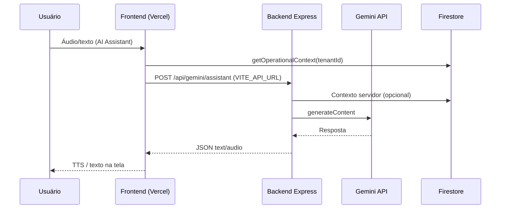

# ARQUITETURA.md — ControlMax

Documento de referência para desenvolvedores e agentes de IA. Descreve fluxos de dados, componentes críticos, deploy na Vercel e diretrizes para refatorações seguras (incluindo SonarQube).

> **Relacionado:** [QA_DOCUMENTATION.md](./QA_DOCUMENTATION.md) · [Divergências.md](./Divergências.md) · [INDEXES.md](./INDEXES.md) · [AGENTS.md](../AGENTS.md)

---

## 1. Visão geral do monorepo

```
ControlMax/
├── frontend/          # React 19 + Vite 6 + Tailwind v4 (SPA)
├── backend/           # Express + Gemini SDK (API do assistente)
├── documentation/     # Manuais técnicos
└── controlmax.old/    # Snapshot funcional pré-refatoração (referência, não deployar)
```

| Camada | Responsabilidade |
|--------|------------------|
| **Frontend** | UI, roteamento, hooks, escrita/leitura Firestore via SDK cliente |
| **Backend** | Endpoint `POST /api/gemini/assistant` (voz/texto + contexto operacional) |
| **Firestore** | Fonte de verdade multi-tenant (`tenantId` em todas as queries) |

---

## 2. Fluxo de dados principal — páginas de cadastro

### 2.1 Padrão arquitetural (pós-refatoração SonarQube)

```
┌─────────────┐     ┌──────────────┐     ┌─────────────────┐     ┌───────────┐
│   Screen    │────▶│  Hook(s)     │────▶│  Utils / Types  │────▶│ Firestore │
│  (shell UI) │     │  data/action │     │  validação      │     │  SDK      │
└─────────────┘     └──────────────┘     └─────────────────┘     └───────────┘
       │                    │
       ▼                    ▼
┌─────────────┐     ┌──────────────┐
│ Componentes │     │ onSnapshot / │
│  de formul. │     │ addDoc / etc │
└─────────────┘     └──────────────┘
```

**Regra:** telas grandes foram divididas em *screen* (orquestração) + *hooks* (estado e I/O) + *components* (JSX). Ao comparar com `controlmax.old`, busque handlers nos hooks — não apenas no arquivo `.tsx` da tela.

### 2.2 Exemplo: cadastro de cliente (`CompanyList`)

1. **Filtros:** `useCompanyListData` carrega centros de negócio e filtra clientes por `tenantId` + `businessCenterId`.
2. **Criação:** `useCustomerCreateForm` mantém `CustomerFormValues`, valida via `validateCustomerForm`, persiste com `buildCustomerPayload` + `persistCustomer`.
3. **Edição (modal):** componentes em `screens/components/customerModal/*` com handlers locais (`handleSaveBasic`, `handleAddAddress`, etc.).
4. **Firestore:** coleção `customers` — payload inclui `businessCenterId`, endereços, telefones, referências e fotos (base64).

### 2.3 Exemplo: formulários dinâmicos (`Forms`)

1. `useFormsData` — `onSnapshot` em `forms` e `form_responses` (filtrado por `tenantId`).
2. `useFormsActions` — CRUD de definições e envio de respostas.
3. Componentes: `FormsBuilderTab`, `FormsListTab`, `FormsFillingModal`.

### 2.4 Exemplo: configuração da plataforma (`PlatformManagement`)

1. `usePlatformSettings` — `getDoc` / `setDoc` em `platform_settings/{tenantId}`.
2. Tipos em `types/platformSettings.ts` — **20 campos** com defaults e mapeamento Firestore.
3. Abas em `screens/components/platform/*` — apenas apresentação; não duplicar lógica de persistência.

### 2.5 Valores monetários

Todos os montantes são **inteiros em centavos** até a camada de exibição (`fmt()`). Nunca persistir `float` para dinheiro.

### 2.6 Isolamento multi-tenant

Toda query/escrita deve incluir `where('tenantId', '==', tenantId)`. Regras em `firestore.rules` reforçam no servidor.

---

## 3. Mapeamento de componentes críticos

Estes módulos possuem lógica de negócio sensível. **Não simplificar nem remover campos sem teste regressivo manual e, preferencialmente, teste automatizado.**

| Módulo | Arquivos principais | Risco se alterado |
|--------|---------------------|-------------------|
| **Clientes** | `CompanyList.tsx`, `useCustomerCreateForm.ts`, `customerCreate.ts`, `customerModal/*` | Perda de campos no cadastro, CN errado no payload |
| **Formulários** | `Forms.tsx`, `useFormsData.ts`, `useFormsActions.ts`, `formsHelpers.ts` | Builder/respostas quebrados |
| **Feriados** | `Holidays.tsx`, `useHolidaysData.ts` | Calendário operacional incorreto |
| **Plataforma** | `PlatformManagement.tsx`, `usePlatformSettings.ts`, `platformSettings.ts` | Config global do tenant |
| **Caixas** | `OpenBox`, `CloseBox`, `BoxSummary`, hooks de box | Integridade financeira |
| **Vendas/Recebimentos** | `SalesList`, `RegisterPayment`, `TransferSales` | Saldos e centavos |
| **Centros de negócio** | `BusinessCenters.tsx`, `useBusinessCentersData.ts` | Unidades e rotas |
| **Layout/Navegação** | `Layout.tsx`, `LayoutDesktopNav.tsx`, `LayoutMobileDrawer.tsx` | Rotas “invisíveis” para o usuário |
| **Firebase** | `lib/firebase.ts` | App não conecta em produção |
| **Assistente IA** | `assistantApi.ts`, `backend/server.ts` | Feature de voz/texto offline |

### 3.1 Rotas que exigem link no menu

Se a rota existe em `AppRoutes.tsx` e `NavigationContext.tsx`, deve haver **caminho de navegação** no Layout (ou documentação explícita de URL direta). Rotas recuperadas nesta rodada:

- `/forms` — admin/supervisor → menu Administración
- `/holidays` — admin/supervisor → menu Administración

---

## 4. Padrões de deploy (Vercel)

### 4.1 Configuração do projeto

**Opção A (recomendada):** Root Directory = `frontend` no painel Vercel.

| Campo | Valor |
|-------|-------|
| Framework Preset | Vite |
| Build Command | `npm run build` |
| Output Directory | `dist` |
| Install Command | `npm ci` |

**Opção B:** Deploy na raiz do monorepo usando `/vercel.json` na raiz (já incluído no repositório).

### 4.2 SPA e React Router

Arquivo `frontend/vercel.json`:

```json
{
  "rewrites": [{ "source": "/(.*)", "destination": "/index.html" }]
}
```

Sem isso, recarregar `/sales` ou qualquer rota profunda retorna **404**.

### 4.3 Variáveis de ambiente obrigatórias (Vercel)

| Variável | Obrigatória | Descrição |
|----------|-------------|-----------|
| `VITE_FIREBASE_API_KEY` | Sim* | Credencial Firebase |
| `VITE_FIREBASE_AUTH_DOMAIN` | Sim* | Domínio Auth |
| `VITE_FIREBASE_PROJECT_ID` | Sim* | ID do projeto |
| `VITE_FIREBASE_STORAGE_BUCKET` | Sim* | Bucket |
| `VITE_FIREBASE_MESSAGING_SENDER_ID` | Sim* | Sender ID |
| `VITE_FIREBASE_APP_ID` | Sim* | App ID |
| `VITE_FIRESTORE_DATABASE_ID` | Sim** | ID do banco Firestore (não-default) |
| `VITE_API_URL` | Sim*** | URL do backend Express em produção |

\* Sem essas variáveis, o build usa `firebase-applet-config.example.json` (stub) e o app não autentica de verdade.

\** Obrigatório na Vercel porque `firebase-applet-config.json` está no `.gitignore`.

\*** O frontend na Vercel **não** executa o Express. O proxy `/api` do Vite só funciona em `npm run dev`. Em produção, `assistantApi.ts` usa `VITE_API_URL` + `/api/gemini/assistant`.

### 4.4 Backend (assistente Gemini)

Deploy separado (Railway, Render, Cloud Run, etc.):

```bash
cd backend
npm ci && npm run build && npm start  # porta 3000
```

Variáveis do backend (`.env`):

- `GEMINI_API_KEY`
- Credenciais Firebase Admin (se aplicável)

### 4.5 Firebase config local vs CI

- **Local:** `frontend/firebase-applet-config.json` (gitignored) — prioridade após env vars.
- **CI/Vercel:** alias Vite `@firebase-config` aponta para `.example.json` se o arquivo real não existir; **env vars sobrescrevem** os valores.

### 4.6 Checklist pré-deploy

```bash
cd frontend && npm run lint && npm run test && npm run build
cd ../backend && npm run build
```

Validar no preview Vercel: login, rota profunda, uma tela de cadastro, assistente (se backend configurado).

---

## 5. Diretrizes para futuras refatorações (SonarQube e outras)

### 5.1 Regra de ouro

> **Funcionalidade > “código limpo”.** Correções SonarQube (segurança, bugs reais, complexidade) devem ser mantidas. Se uma correção quebrar layout ou remover campo visível, priorize restaurar o comportamento e marque com comentário `// SONAR-REGRESSION: revisar`.

### 5.2 Antes de refatorar uma tela de cadastro

1. Listar campos do formulário (labels, `useState`, payload Firestore).
2. Comparar com `controlmax.old` ou snapshot de teste.
3. Extrair para hook/componente **sem alterar** o contrato de dados persistido.
4. Rodar `npm run lint` e `npm run test`.
5. Teste manual da tela no modo claro/escuro.

### 5.3 O que o SonarQube pode fazer com segurança

- Extrair funções puras para `utils/`
- Dividir JSX em subcomponentes
- Mover `useEffect`/`onSnapshot` para hooks `use*Data`
- Renomear variáveis para clareza
- Adicionar tipagem estrita

### 5.4 O que exige cuidado extra

- Remover `useState` “não usado” (pode ser props de subcomponente futuro)
- Remover campos “opcionais” do payload Firestore
- Unificar handlers distintos (create vs edit)
- Alterar ordem de validação que bloqueia submit
- Mudar imports de `firebase-applet-config.json` sem fallback para CI

### 5.5 Processo recomendado pós-varredura SonarQube

1. Corrigir issues por **módulo**, não por “arquivo maior”.
2. Após cada módulo: diff funcional contra `.old` ou checklist em `Divergências.md`.
3. Atualizar `Varredura.md` com rodada e contagem de issues.
4. Não declarar “paridade” só porque `tsc` passa — validar UI.

---

## 6. Diagrama — assistente IA em produção



---

## 7. Índice de hooks por domínio

| Domínio | Hooks |
|---------|-------|
| Clientes | `useCompanyListData`, `useCompanyListCustomers`, `useCustomerCreateForm`, `useCustomerModal` |
| Formulários | `useFormsData`, `useFormsActions` |
| Feriados | `useHolidaysData` |
| Plataforma | `usePlatformSettings` |
| Usuários | `useUserListData` |
| Crédito | `useCreditRequestsData` |
| Centros | `useBusinessCentersData` |
| Receitas/Despesas | `useNewIncomeData`, `useNewExpenseData` |

---

## 8. Manutenção deste documento

Atualize `ARQUITETURA.md` quando:

- Nova tela de cadastro for criada
- Variáveis de deploy mudarem
- Backend ganhar novos endpoints consumidos pelo frontend
- Componente crítico for extraído ou renomeado

Última revisão: **10/07/2026** — recuperação pós-varredura SonarQube e correções Vercel.
